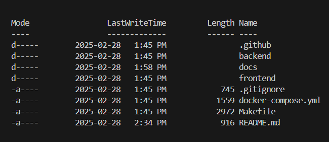

# Project Summary
RestroSync is a restaurant management system designed to streamline daily operations, enhance customer experience, and optimize business performance. By integrating table management, order processing, menu control, and sales analytics, RestroSync helps restaurants operate more efficiently while providing valuable insights for data-driven decision-making.

# Running the application
***Note: Make sure 'Docker' application is running in the background before starting step 1 and stays on until you use close the application.***
1. In the terminal, make sure to stay in the parent directory so that you are able to see the following directories if you do 'ls'



2. Run the following command in the terminal to start the application
   
```{bash}
make up-build
```

3. Go to the following link :
[RestroSync](http://localhost:8017)

# Stopping the application
1. In the terminal, run the following command to stop the application:

***Note: These command will also remove docker container and volumes***

```{bash}
make down-volumes
```

# Link to documents
[Vision Statement](docs/Vision_Statement.md#vision-statement)

[Core Feeatures](docs/Core_Features.md#core-features)

[User Stories](docs/User_Stories.md#user-stories)

[Tools and Technologies](docs/Technologies.md#technologies)

[Architecture Diagram](docs/Architecture_Diagrams/Architecture_Diagram_v2.png)

[Branching and Commiting Strategy](docs/Branching-and-Commiting-strategy.md#branching)

[Test Plan](docs/RestroSync_Test_Plan.pdf)

[Our Contributors](docs/Contributors.md)
